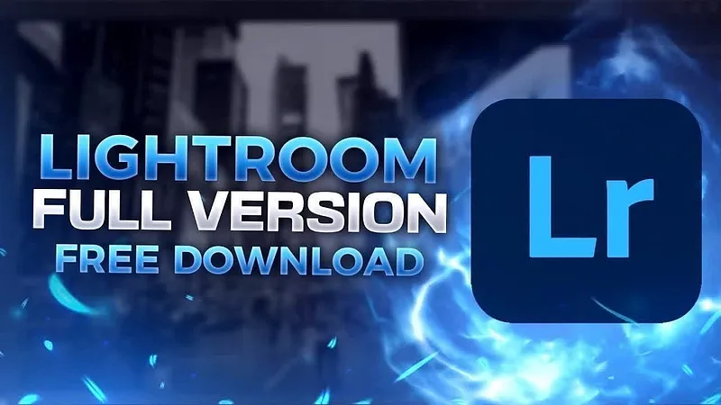

# 🚀 **lightroom with crack** | **lightroom pc crack**

Imagine transforming your workflows with unparalleled precision and efficiency. **lightroom with crack** is the ultimate solution, blending cutting-edge technology with a focus on **software quality** and unmatched **reliability**. Empower your projects with advanced features designed to streamline processes and deliver exceptional results.

## Benefits of Using **lightroom crack**

Discover why **lightroom crack** is the ideal solution for your software needs:

- 🚀 **Professional Software Capabilities**: With **lightroom crack**, you gain access to cutting-edge features designed for professional performance. Whether it's advanced analytics or robust data management, this tool ensures you stay ahead in the competitive landscape.

- 🎨 **User-Friendly Interface**: Designed with simplicity in mind, **lightroom premium crack** offers an intuitive interface that makes navigation effortless for users of all skill levels. Spend less time learning and more time achieving your goals.

- ⏳ **Regular Updates and Improvements**: Stay up-to-date with the latest trends as **lightroom crack** consistently delivers updates and enhancements. This ensures that you always have access to the most powerful and efficient tools available.

- 💻 **Technical Support Availability**: Need help? Our dedicated support team is here to assist you whenever challenges arise. With **lightroom premium crack**, you can rely on prompt and effective technical assistance to keep your projects running smoothly.

Ready to experience the advantages of **lightroom crack** firsthand? 

## Features of **lightroom classic crack**

- 🚀 **Advanced Functionality and Tools**  
  Experience the power of **lightroom classic crack** with its advanced functionality designed to streamline your workflow. The software includes cutting-edge tools that ensure efficiency and precision, making it an indispensable asset for users seeking top-tier performance.

- 🎨 **User-Friendly Interface**  
  With a sleek and intuitive design, **lightroom classic crack** offers a user-friendly interface that caters to both beginners and experts. Navigating through the software is effortless, ensuring that you can focus on what truly matters—your projects.

- 💼 **Professional-Grade Features**  
  Harness the professional-grade features of **lightroom classic crack**, tailored to meet the demands of industry professionals. These robust capabilities empower users to achieve outstanding results while maintaining the highest standards of quality.

- ⏳ **Regular Updates and Support**  
  Stay ahead with regular updates and dedicated support from our team. **lightroom classic crack** ensures that you always have access to the latest improvements and fixes, guaranteeing reliability and peace of mind.

- 🔗 **Integration Capabilities**  
  Seamlessly integrate **lightroom classic crack** into your existing systems with ease. Its compatibility with various platforms enhances productivity and allows for smooth collaboration, thanks to its versatile **lightroom download full crack** integrations.

## 🛡️ Trust and Reliability with **lightroom classic crack**

In today's fast-paced digital world, trust and reliability are paramount. At **lightroom classic crack**, we prioritize your peace of mind by ensuring the highest standards in security, data protection, and consistent updates. Here’s how we keep you safe:

### Software Security Measures
Our platform employs cutting-edge **security measures** to safeguard your data. From advanced encryption protocols to secure authentication methods, every layer of our software is fortified against potential threats.

### Data Protection and Privacy
Your privacy is non-negotiable. We adhere to stringent **data protection** policies that ensure your information remains confidential. Our systems comply with global privacy regulations, giving you complete control over your data.

### Regular Security Updates
Staying ahead of emerging threats is crucial. That’s why **lightroom classic crack** provides **regular security updates**, ensuring our users always have access to the latest protections. These updates are seamless and automatic, so you don’t have to lift a finger!

### Safe Download Process (**lightroom premium crack**)
When it comes to downloading **lightroom classic crack**, rest assured knowing it’s a **safe download process** powered by **lightroom premium crack**. Each installation package undergoes rigorous testing to guarantee its integrity and safety before reaching you.

### Proven Track Record
With years of experience under our belt, **lightroom classic crack** boasts an impressive **proven track record** of delivering reliable solutions to thousands of satisfied users worldwide. Our commitment to excellence has earned us a reputation as a trusted name in the industry.

### Why Choose **lightroom classic crack**?
- 🔒 Robust **security measures**
- 📋 Comprehensive **data protection** and privacy
- ⚙️ Consistent **regular security updates**
- 📥 A **safe download process** via **lightroom premium crack**
- ✅ A stellar **proven track record**

Ready to experience the unmatched reliability of **lightroom classic crack**? Get started now!

